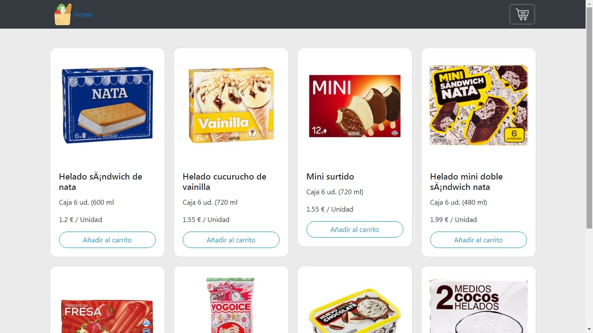

# carrito-tienda-online
carrito tienda online js

Este  es un proyecto de una API restful de un carrito de compra hecho en la ultima version de javascript ECMAscript 6 y el framework css bootstrap

Este proyecto de e-comerce en js permite al usuario 
1-Agregar y eliminar producto al carrito 
2-Hacer compras de varios productos y la cantidad deseada del mismo producto por el ususario con el boton "+/-"

### :computer: Carrito tenda online
 ----------------------- 

### 🛠️ Instalacion
1. hacer download del archivo .zip
2. instalar un servidor local como **MAMP,LAMP O XAMMP**,en caso de tener instalado colocar los archivos en la carpeta por ej: MAMP/htdocs
3. Para ejecutar en el navegador localhost:8080/MAMP/htdocs/nombre-carpeta/index.html

### ✔ Status
---------------
Proyecto terminado

### 🎁 Contenido
---------------
1. Nombre del proyecto
2. Tecnologias
3. Funcionalidades
4. Captura de pantalla
5. Instalacion
6. Status
7. Contenido
 
